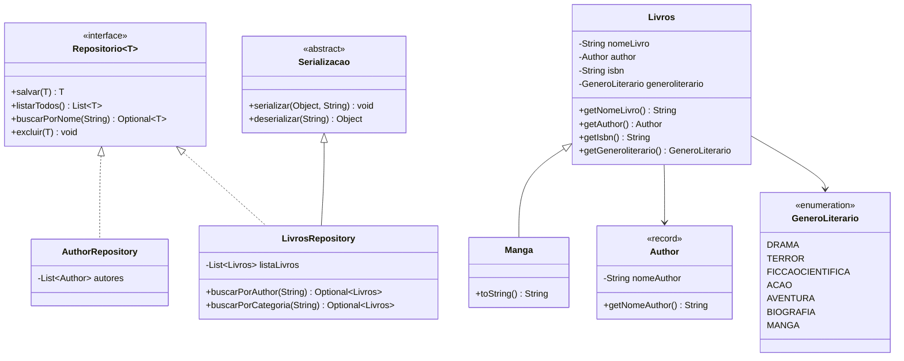

# 📚 Sistema de Gestão de Biblioteca — Java Puro

> **Projeto 1** do [roadmap de migração PHP → Java](https://github.com/andrebbezerra/PortifolioJava) — portfólio para vagas Java Pleno/Sênior.

Aplicação de linha de comando (CLI) para cadastro e consulta de livros e autores, escrita em **Java puro**, sem frameworks. O objetivo deste projeto não é a funcionalidade em si, mas provar domínio de **POO, Collections, Streams, Generics, tratamento de exceções e persistência em arquivo** — a base que qualquer framework (Spring incluso) esconde por baixo dos panos.

---

## 🎯 Objetivo do projeto

Este é o primeiro de uma série de 9 projetos que compõem minha migração de PHP/Scriptcase para Java, com foco em atingir o nível de competência técnica esperado em vagas Pleno/Sênior no mercado brasileiro. Aqui, a proposta é deliberadamente **não usar nenhum framework** (nada de Spring, Hibernate, Lombok) para forçar o entendimento do que a JVM e a linguagem oferecem nativamente, antes de qualquer "mágica" de framework por cima.

---

## ✅ Funcionalidades

- Cadastro de livros (incluindo o subtipo especial **Mangá**, com campo de edição)
- Atualização de livro cadastrado
- Exclusão de livro
- Consulta de livro por nome
- Listagem de todos os livros cadastrados
- Consulta de livros por autor
- Consulta de livros por categoria/gênero literário
- **Persistência em arquivo** entre execuções (serialização binária) — os dados sobrevivem ao fechar o programa

---

## 🧠 Conceitos de Java demonstrados

| Conceito | Onde está no código |
|---|---|
| **Classes e encapsulamento** | `Livros`, `Author`, `AuthorRepository`, `LivrosRepository` |
| **Herança** | `Manga extends Livros` — um mangá *é um* livro, com um campo adicional (edição) |
| **Polimorfismo** | `Manga` sobrescreve `toString()`; tratado como `Livros` em todas as coleções e repositórios |
| **Classes abstratas** | `Serializacao` — classe abstrata que encapsula a lógica de serializar/deserializar objetos em arquivo, reutilizada por `LivrosRepository` |
| **Interfaces + Generics** | `Repositorio<T>` — contrato único (`salvar`, `listarTodos`, `buscarPorNome`, `excluir`) reaproveitado por `AuthorRepository` e `LivrosRepository`, cada um parametrizado com seu tipo |
| **Records (imutabilidade)** | `Author` é um `record` — DTO/entidade imutável, sem boilerplate de getters/equals/hashCode |
| **Enums** | `GeneroLiterario` — restringe os gêneros literários válidos a um conjunto fechado de valores |
| **Collections Framework** | `List<Livros>`, `List<Author>` como estruturas internas dos repositórios |
| **Streams + Lambdas** | Buscas por nome, autor e categoria usam `stream().filter(...).findFirst()` ao invés de laços manuais |
| **Optional** | Todo método de busca retorna `Optional<T>`; no `Main`, o valor é sempre desembrulhado com `.map(...).orElse(...)`, nunca impresso "cru" |
| **Tratamento de exceções** | `IllegalArgumentException` capturada ao converter `String` para `GeneroLiterario` via `valueOf()`, evitando que uma entrada inválida derrube o programa |
| **Persistência em arquivo (serialização)** | `Serializacao` usa `ObjectOutputStream`/`ObjectInputStream` para gravar/ler o estado da lista de livros em `livraria.byte` |

> Comparando com o mundo PHP: aqui não existe um `array` genérico fazendo o papel de tudo. `Repositorio<T>` é o equivalente tipado a um "repository trait" que qualquer classe PHP poderia implementar magicamente com duck typing — em Java, o contrato é explícito e verificado em tempo de compilação.

---

## 🗺️ Diagrama de classes



---

## 🧩 Decisões de design

- **`Repositorio<T>` como interface genérica única**: em vez de repetir os mesmos quatro métodos em cada repositório, a interface genérica garante o mesmo contrato para `Author` e `Livros`, com o compilador cobrando a implementação correta em cada tipo.
- **`Livros` referencia `Author`, nunca `AuthorRepository`**: entidades de domínio armazenam outras entidades de domínio, nunca uma classe de acesso a dados. Essa foi uma correção de arquitetura importante em relação a versões anteriores do projeto, onde essa camada estava misturada.
- **Estado de instância, não `static`**: `LivrosRepository` e `AuthorRepository` guardam suas listas como campos de instância. Isso evita o bug clássico de estado compartilhado entre instâncias diferentes — e força o `Main` a manter uma única instância viva do repositório durante toda a execução, em vez de recriá-la a cada operação.
- **`Serializacao` como classe abstrata**: a lógica de leitura/escrita em arquivo é genérica o suficiente para não pertencer só a `LivrosRepository`. Herdar de uma classe abstrata (em vez de duplicar o código) é o motivo de ela existir como classe e não como método utilitário estático.
- **`Manga extends Livros`**: um mangá é um livro com uma particularidade (edição), então a modelagem usa herança em vez de um campo opcional `edicao` dentro de `Livros` — evita que todo `Livros` carregue um atributo que só faz sentido para um subtipo.
- **`Optional<T>` em todas as buscas**: nenhum método de busca retorna `null`. O chamador é obrigado a lidar explicitamente com a ausência de valor via `.map()`/`.orElse()`.
- **Persistência simples via serialização binária**: para este estágio do roadmap (antes de JDBC/JPA no Projeto 2), a serialização nativa do Java (`Serializable`) foi escolhida por ser a forma mais direta de garantir persistência entre execuções sem introduzir um banco de dados — que é justamente o assunto do próximo projeto.

---

## 📁 Estrutura do projeto

```
src/
├── main/java/org/example/
│   ├── Main.java                       # Menu CLI e orquestração das operações
│   ├── data/
│   │   └── Serializacao.java           # Classe abstrata: persistência em arquivo
│   ├── entity/
│   │   ├── Author.java                 # record (imutável)
│   │   ├── GeneroLiterario.java        # enum
│   │   ├── Livros.java                 # entidade base
│   │   └── Manga.java                  # subtipo de Livros (herança)
│   └── repository/
│       ├── Repositorio.java            # interface genérica
│       ├── AuthorRepository.java
│       └── LivrosRepository.java
└── test/java/org/example/
    └── repository/
        └── AuthorRepositoryTest.java
```

---

## ▶️ Como rodar

**Pré-requisitos:** JDK 17+ e Maven.

```bash
git clone https://github.com/andrebbezerra/PortifolioJava.git
cd PortifolioJava
mvn compile exec:java -Dexec.mainClass="org.example.Main"
```

Ou, importando o projeto em uma IDE (IntelliJ recomendado), basta rodar a classe `Main`.

Ao executar, o menu interativo é exibido no terminal:

```
Qual opção você gostaria de executar?
-------------------------------------
1 - Adicionar um livro
2 - Atualizar um livro
3 - Excluir um livro
4 - Consultar um livro Cadastrado pelo nome
5 - Consultar Lista de livros Cadastrados
6 - Consultar Livros por Autor
7 - Consultar Livros por Categoria(DRAMA,TERROR,FICCAOCIENTIFICA,ACAO,AVENTURA,BIOGRAFIA)
8 - Sair do Programa
```

Os dados ficam persistidos em `livraria.byte` na raiz do projeto — feche e reabra o programa para confirmar que os livros cadastrados continuam lá.

---

## 🧪 Testes

O projeto já tem a estrutura de testes com **JUnit 5** configurada via Maven (`junit-jupiter`), com a classe `AuthorRepositoryTest` criada cobrindo os métodos `salvar`, `listarTodos` e `buscarPorNome`.

> **Status atual:** os testes estão com a estrutura (assinatura dos métodos) criada, mas ainda sem asserções implementadas. Isso é um item aberto — testes de verdade só se tornam obrigatórios a partir do Projeto 4 do roadmap, mas a intenção é começar a praticar `assertEquals`/`assertTrue` aqui mesmo, de forma incremental.

---

## 🔭 Próximos passos (roadmap deste projeto)

- [ ] Implementar as asserções reais em `AuthorRepositoryTest`
- [ ] Adicionar testes equivalentes para `LivrosRepository`
- [ ] Avaliar exceção customizada (`GeneroLiteralarioInvalidoException`) em vez de capturar `IllegalArgumentException` genérica
- [ ] Documentar no README a diferença entre exceptions *checked* e *unchecked* usadas no projeto (conceito sem equivalente direto em PHP)
- [ ] Revisão final antes de avançar para o **Projeto 2** (JDBC → JPA/Hibernate)

---

## 🔗 Contexto do portfólio

Este repositório faz parte de uma série de 9 projetos progressivos documentados no [roadmap de migração PHP → Java](https://github.com/andrebbezerra/PortifolioJava), cobrindo desde fundamentos da linguagem até microsserviços, mensageria e observabilidade em nuvem.

**Stack de origem:** PHP, Scriptcase, PostgreSQL (10+ anos de experiência)
**Stack de destino:** Java, Spring Boot, JPA/Hibernate, Spring Security, Kafka/RabbitMQ, Docker, observabilidade (Prometheus/Grafana/OpenTelemetry)

---

## 👤 Autor

**André Bezerra**
[github.com/andrebbezerra](https://github.com/andrebbezerra)
